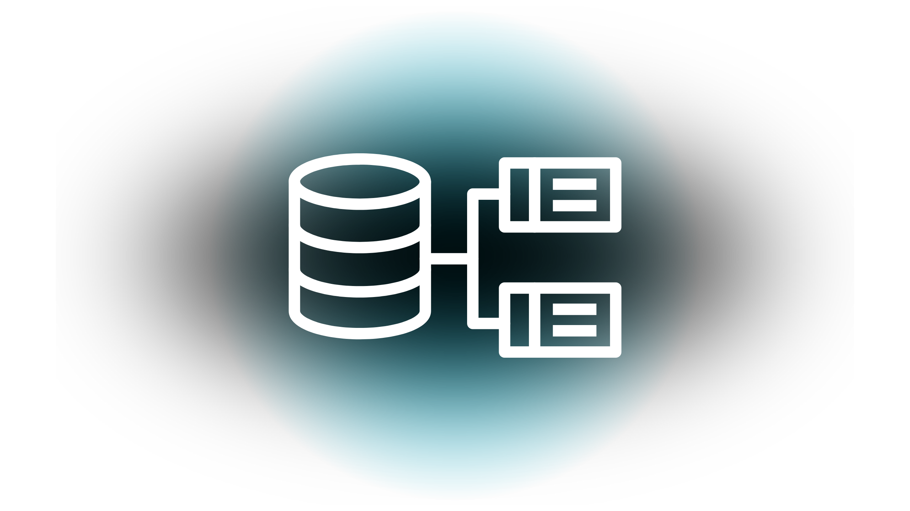

  

<h1 align="center" style="font-size: 40px">ساختمان داده</h1>

  <strong style="font-size: 22px">استاد رضا احسن - ادیت 98</strong>  
  بازنویسی توسط امیرحسین سلیمانی

 <!-- fsf -->

<h2 align="center" style="font-size: 28px">فهرست مطالب</h2>

- مقدمه
- جلسه اول
    - پیچیدگی زمانی
    - استفاده از سیگما
    - حل چند مثال
    - تمرین
- جلسه دوم
    - مرتب سازی انتخابی
- جلسه سوم
    - مرتب سازی حبابی (همسایه ها)
    - آرایه دو بعدی
    - آرایه سه بعدی
- جلسه چهارم
    - ترانهاده
    - جمع ماتریس
    - ضرب ماتریس
- جلسه پنجم
    - توان ماتریس
    - تبدیل ماتریس به ماتریس خلوت
- جلسه ششم
    - تبدیل ماتریس خلوت به ماتریس
    - صف
    - صف حلقوی
- جلسه هفتم
    - پشته
- جلسه هشتم
    - لیست پیوندی
- جلسه نهم
    - حذف از لیست پیوندی
    - لیست خطی
    - لیست حلقوی
- جلسه دهم
    - لیست پیوندی